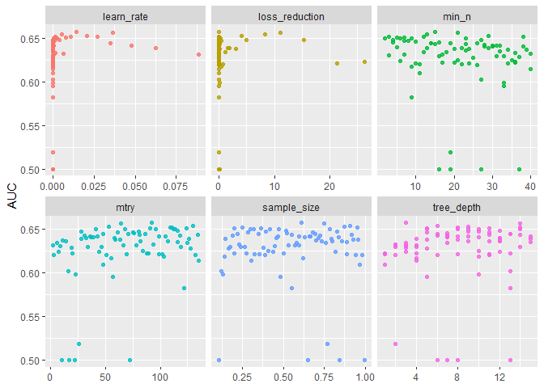
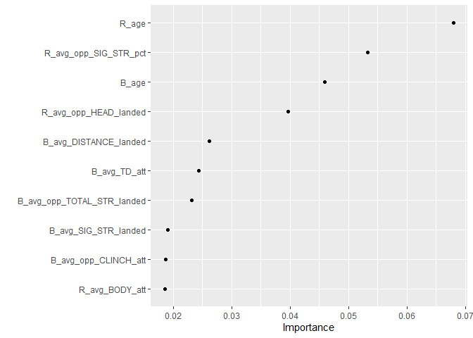
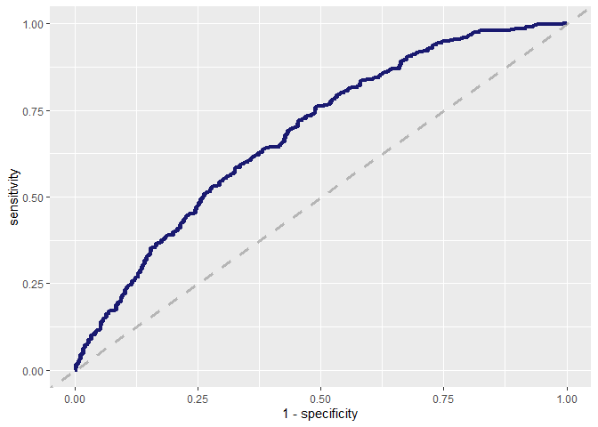
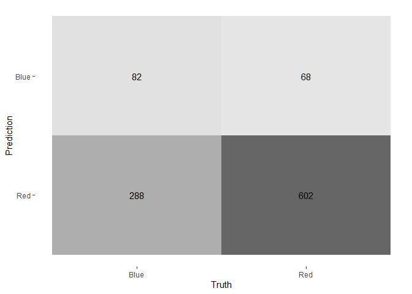

ufc\_prediction
================
Chris Oh
2021 5 20

Libraries

``` r
library(tidyverse)
library(lubridate)
library(xgboost)
library(tidymodels)
library(vip)
```

## Import and cleaning

``` r
fights <- read_csv(str_c(path_files, "data.csv"))
```

    ## 
    ## -- Column specification --------------------------------------------------------
    ## cols(
    ##   .default = col_double(),
    ##   R_fighter = col_character(),
    ##   B_fighter = col_character(),
    ##   Referee = col_character(),
    ##   date = col_date(format = ""),
    ##   location = col_character(),
    ##   Winner = col_character(),
    ##   title_bout = col_logical(),
    ##   weight_class = col_character(),
    ##   B_Stance = col_character(),
    ##   R_Stance = col_character()
    ## )
    ## i Use `spec()` for the full column specifications.

Let’s check for NA’s.

``` r
fights %>% 
  summarize(across(everything(), ~sum(is.na(.))/n()))
```

    ## # A tibble: 1 x 144
    ##   R_fighter B_fighter Referee  date location Winner title_bout weight_class
    ##       <dbl>     <dbl>   <dbl> <dbl>    <dbl>  <dbl>      <dbl>        <dbl>
    ## 1         0         0 0.00532     0        0      0          0            0
    ## # ... with 136 more variables: B_avg_KD <dbl>, B_avg_opp_KD <dbl>,
    ## #   B_avg_SIG_STR_pct <dbl>, B_avg_opp_SIG_STR_pct <dbl>, B_avg_TD_pct <dbl>,
    ## #   B_avg_opp_TD_pct <dbl>, B_avg_SUB_ATT <dbl>, B_avg_opp_SUB_ATT <dbl>,
    ## #   B_avg_REV <dbl>, B_avg_opp_REV <dbl>, B_avg_SIG_STR_att <dbl>,
    ## #   B_avg_SIG_STR_landed <dbl>, B_avg_opp_SIG_STR_att <dbl>,
    ## #   B_avg_opp_SIG_STR_landed <dbl>, B_avg_TOTAL_STR_att <dbl>,
    ## #   B_avg_TOTAL_STR_landed <dbl>, B_avg_opp_TOTAL_STR_att <dbl>,
    ## #   B_avg_opp_TOTAL_STR_landed <dbl>, B_avg_TD_att <dbl>,
    ## #   B_avg_TD_landed <dbl>, B_avg_opp_TD_att <dbl>, B_avg_opp_TD_landed <dbl>,
    ## #   B_avg_HEAD_att <dbl>, B_avg_HEAD_landed <dbl>, B_avg_opp_HEAD_att <dbl>,
    ## #   B_avg_opp_HEAD_landed <dbl>, B_avg_BODY_att <dbl>, B_avg_BODY_landed <dbl>,
    ## #   B_avg_opp_BODY_att <dbl>, B_avg_opp_BODY_landed <dbl>, B_avg_LEG_att <dbl>,
    ## #   B_avg_LEG_landed <dbl>, B_avg_opp_LEG_att <dbl>,
    ## #   B_avg_opp_LEG_landed <dbl>, B_avg_DISTANCE_att <dbl>,
    ## #   B_avg_DISTANCE_landed <dbl>, B_avg_opp_DISTANCE_att <dbl>,
    ## #   B_avg_opp_DISTANCE_landed <dbl>, B_avg_CLINCH_att <dbl>,
    ## #   B_avg_CLINCH_landed <dbl>, B_avg_opp_CLINCH_att <dbl>,
    ## #   B_avg_opp_CLINCH_landed <dbl>, B_avg_GROUND_att <dbl>,
    ## #   B_avg_GROUND_landed <dbl>, B_avg_opp_GROUND_att <dbl>,
    ## #   B_avg_opp_GROUND_landed <dbl>, B_avg_CTRL_time(seconds) <dbl>,
    ## #   B_avg_opp_CTRL_time(seconds) <dbl>, B_total_time_fought(seconds) <dbl>,
    ## #   B_total_rounds_fought <dbl>, B_total_title_bouts <dbl>,
    ## #   B_current_win_streak <dbl>, B_current_lose_streak <dbl>,
    ## #   B_longest_win_streak <dbl>, B_wins <dbl>, B_losses <dbl>, B_draw <dbl>,
    ## #   B_win_by_Decision_Majority <dbl>, B_win_by_Decision_Split <dbl>,
    ## #   B_win_by_Decision_Unanimous <dbl>, B_win_by_KO/TKO <dbl>,
    ## #   B_win_by_Submission <dbl>, B_win_by_TKO_Doctor_Stoppage <dbl>,
    ## #   B_Stance <dbl>, B_Height_cms <dbl>, B_Reach_cms <dbl>, B_Weight_lbs <dbl>,
    ## #   R_avg_KD <dbl>, R_avg_opp_KD <dbl>, R_avg_SIG_STR_pct <dbl>,
    ## #   R_avg_opp_SIG_STR_pct <dbl>, R_avg_TD_pct <dbl>, R_avg_opp_TD_pct <dbl>,
    ## #   R_avg_SUB_ATT <dbl>, R_avg_opp_SUB_ATT <dbl>, R_avg_REV <dbl>,
    ## #   R_avg_opp_REV <dbl>, R_avg_SIG_STR_att <dbl>, R_avg_SIG_STR_landed <dbl>,
    ## #   R_avg_opp_SIG_STR_att <dbl>, R_avg_opp_SIG_STR_landed <dbl>,
    ## #   R_avg_TOTAL_STR_att <dbl>, R_avg_TOTAL_STR_landed <dbl>,
    ## #   R_avg_opp_TOTAL_STR_att <dbl>, R_avg_opp_TOTAL_STR_landed <dbl>,
    ## #   R_avg_TD_att <dbl>, R_avg_TD_landed <dbl>, R_avg_opp_TD_att <dbl>,
    ## #   R_avg_opp_TD_landed <dbl>, R_avg_HEAD_att <dbl>, R_avg_HEAD_landed <dbl>,
    ## #   R_avg_opp_HEAD_att <dbl>, R_avg_opp_HEAD_landed <dbl>,
    ## #   R_avg_BODY_att <dbl>, R_avg_BODY_landed <dbl>, R_avg_opp_BODY_att <dbl>,
    ## #   R_avg_opp_BODY_landed <dbl>, R_avg_LEG_att <dbl>, R_avg_LEG_landed <dbl>,
    ## #   R_avg_opp_LEG_att <dbl>, ...

Fights where the fight stats are missing should be excluded.

``` r
fights_processed <-
  fights %>% 
  drop_na(B_avg_KD, R_avg_KD)
```

The Unified Rules of MMA has been in effect after April 2001 - before,
the rules of the fights varied significantly to what they are now.

Hence, we exclude the older fights from our analysis.

We also remove all the variables that should not be relevant to the
prediction.

Let’s also exclude fights that ended in draws, as well as the variable
that records each fighter’s number of draws (mostly 0).

``` r
fights_processed <-
  fights_processed %>% 
  filter(date > ymd("2001-04-01")) %>% 
  select(
    -Referee,
    -location,
     # We have a better measure called fighter weight that is a continuous version
    # weightclass variable
    -weight_class
  ) %>% 
  filter(Winner %in% c("Red", "Blue")) %>% 
  select(-R_draw, -B_draw, -R_fighter, -B_fighter, -date) %>% 
  mutate(Winner = as.factor(Winner))
```

## Modelling with XGBoost

XGBoost has proven to be highly effective with structured data while
requiring minimal data pre-processing.

Let’s define the last of the preprocessing steps so as to prevent data
leakage.

``` r
set.seed(123)
fights_split <- initial_split(fights_processed, strata = Winner)
fights_train <- training(fights_split)
fights_test <- testing(fights_split)

xgb_rec <- 
  recipe(Winner ~ ., data = fights_train) %>%
  # median imputation for ages
  step_impute_median(R_age, B_age) %>%
  # mode (most common values) imputation for stances
  step_impute_mode(R_Stance, B_Stance) %>% 
  # impute height and reach stats
  step_impute_bag(R_Height_cms, B_Height_cms, R_Reach_cms, B_Reach_cms) %>% 
  # One hot encode categorical features
  step_dummy(all_nominal_predictors())
```

Hyperparameter tuning

``` r
xgb_spec <-
  boost_tree(
    mode = "classification",
    engine = "xgboost",
    mtry = tune(),
    trees = 500,
    min_n = tune(),
    tree_depth = tune(),
    learn_rate = tune(),
    loss_reduction = tune(),
    sample_size = tune()
  )

xgb_flow <-
  workflow() %>% 
  add_recipe(xgb_rec) %>% 
  add_model(xgb_spec)

#Latin cube to fill in the grid with evenly spaced points
xgb_grid<-
  grid_latin_hypercube(
    finalize(mtry(), fights_train),
    min_n(),
    tree_depth(),
    learn_rate(),
    loss_reduction(),
    sample_size = sample_prop(),
    size = 80
  )
```

Conduct CV for hyperparameter tuning

``` r
set.seed(123)
fights_cv <- vfold_cv(fights_train, v = 5, strata = Winner)
```

``` r
doParallel::registerDoParallel()

set.seed(123)
xgb_tune <-
  tune_grid(
    xgb_flow,
    resamples = fights_cv,
    grid = xgb_grid,
    control = control_grid(save_pred = TRUE)
  )
```

#### view CV results

``` r
xgb_tune %>% 
  collect_metrics() %>% 
  filter(.metric == "roc_auc") %>%
  select(mean, mtry:sample_size) %>%
  pivot_longer(mtry:sample_size,
               values_to = "value",
               names_to = "parameter"
  ) %>%
  ggplot(aes(value, mean, color = parameter)) +
  geom_point(alpha = 0.8, show.legend = FALSE) +
  facet_wrap(~parameter, scales = "free_x") +
  labs(x = NULL, y = "AUC")
```

<!-- -->

``` r
show_best(xgb_tune)
```

    ## Warning: No value of `metric` was given; metric 'roc_auc' will be used.

    ## # A tibble: 5 x 12
    ##    mtry min_n tree_depth learn_rate loss_reduction sample_size .metric
    ##   <int> <int>      <int>      <dbl>          <dbl>       <dbl> <chr>  
    ## 1    92    15          3    0.0144         0.0155        0.611 roc_auc
    ## 2    64    21         14    0.0366        11.1           0.750 roc_auc
    ## 3   130    13          6    0.00526        8.35          0.909 roc_auc
    ## 4    53    29          9    0.0208         4.09          0.871 roc_auc
    ## 5   109    38         14    0.0107         0.00278       0.954 roc_auc
    ## # ... with 5 more variables: .estimator <chr>, mean <dbl>, n <int>,
    ## #   std_err <dbl>, .config <chr>

Select the best performing specification

``` r
xgb_best <- select_best(xgb_tune, "roc_auc")
xgb_fin <- 
  finalize_workflow(
    xgb_flow,
    xgb_best
  )

xgb_fin
```

    ## == Workflow ====================================================================
    ## Preprocessor: Recipe
    ## Model: boost_tree()
    ## 
    ## -- Preprocessor ----------------------------------------------------------------
    ## 4 Recipe Steps
    ## 
    ## * step_impute_median()
    ## * step_impute_mode()
    ## * step_impute_bag()
    ## * step_dummy()
    ## 
    ## -- Model -----------------------------------------------------------------------
    ## Boosted Tree Model Specification (classification)
    ## 
    ## Main Arguments:
    ##   mtry = 92
    ##   trees = 500
    ##   min_n = 15
    ##   tree_depth = 3
    ##   learn_rate = 0.0144173950439678
    ##   loss_reduction = 0.0155172592975002
    ##   sample_size = 0.6112528019608
    ## 
    ## Computational engine: xgboost

Variable importance plot

``` r
xgb_fin %>%
  fit(data = fights_train) %>%
  extract_fit_parsnip() %>%
  vip(geom = "point")
```

    ## [22:42:59] WARNING: amalgamation/../src/learner.cc:1095: Starting in XGBoost 1.3.0, the default evaluation metric used with the objective 'binary:logistic' was changed from 'error' to 'logloss'. Explicitly set eval_metric if you'd like to restore the old behavior.

<!-- -->

Model evaluation

``` r
xgb_final_fit <-
  last_fit(xgb_fin, fights_split)
collect_metrics(xgb_final_fit)
```

    ## # A tibble: 2 x 4
    ##   .metric  .estimator .estimate .config             
    ##   <chr>    <chr>          <dbl> <chr>               
    ## 1 accuracy binary         0.658 Preprocessor1_Model1
    ## 2 roc_auc  binary         0.682 Preprocessor1_Model1

ROC Plot

``` r
xgb_final_fit %>%
  collect_predictions() %>%
  roc_curve(Winner, .pred_Blue) %>%
  ggplot(aes(x = 1 - specificity, y = sensitivity)) +
  geom_line(size = 1.5, color = "midnightblue") +
  geom_abline(
    lty = 2, alpha = 0.5,
    color = "gray50",
    size = 1.2
  )
```

<!-- -->

Confusion Matrix

``` r
xgb_final_fit %>% 
  collect_predictions() %>% 
  conf_mat(truth = Winner, estimate = .pred_class) %>% 
  autoplot(type = "heatmap")
```

<!-- -->

## Final Thoughts

XGBoost is shown to do a relatively good job of predicting a majority
class (Red corner winning), but not so much for the minority class (Blue
corner winning).

Besides the bragging rights for a correct prediction, people often bet
on fights based on the odds. To optimize a betting strategy ie
maximizing the expected profits, we would need to augment the data with
odds data for each fight and incorporate the odds to the loss function.
